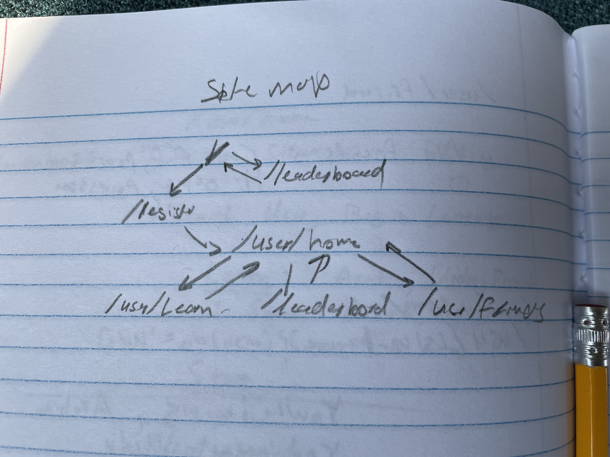

# Transfer

## Overview

Learning a new language is *hard*, **if** you don't already know a similar language. Transfer is a web app designed to make it easy for someone to quickly learn a new language by learning the cognates and similar features between the two languages.

The app will allow users to answer questions and read/learn words in a different language leveraging the language they currently know. There will be a leaderboard where users can compete with each other to score the highest for the day or all time where points are given based on a super secret algorithm incorporating question accuracy, cognates learned, the disparity between two languages etc. The first version will only be able to support English, French, Arabic, and Urdu.

## Data Model

The application will store Users, and additional User metadata such as friends, points, the language being learned and the streak.

An Example User Document:

```Javascript
{
  username: "learner",
  hash: //a password hash,
  userid: // a unique user id for reference
  metadata //another table that references user meta data
}
```

An Example of some metadata associated with a user

```Javascript
{
  userid // which references a user,
  points: 298375,
  streak: 37920
  friends: list(user ids)
}
```


## [Link to Commented First Draft Schema](transfer/app/_data/db.mjs) 

## Wireframes

/user/home - The home page a user will see when they register (top)<br>
/leaderboard - The leaderboard of the top users for the day (bottom)


/user/friends -The page where a user can view their friends and the points they have (top)<br>
/user/learn/languageslug?originlang - the page where a user starts learning the language (bottom)


## Site map



## User Stories or Use Cases

1. as non-registered user, I can register a new account with the site
2. as a user, I can log in to the site
3. as a user, I can choose my learning path
4. as a user, I can view what is in my learning path
5. as a user, I can answer questions to improve my score
6. as a user, I can view other people on the leaderboards
7. as a user, I can make friends with other users

## Research Topics

* (2 points) Tailwind CSS
    * I'm going to use Tailwind CSS for styling the project with decent configuration.
* (3 points) Display graphs with d3.js 
    * Using d3.js I will display the leaderboard and points of different users per day.
* (5 points) Next.js & TypeScript
    * I'm going to be using Next.js as a framework for building the project alongside TypeScript. Since Next.js is fast and efficient and doing it well is moderately difficult I've given it 5 points.

10 points total out of 10 required points

## [Link to Initial Main Project File](transfer/app/page.tsx) 

## Annotations / References Used

